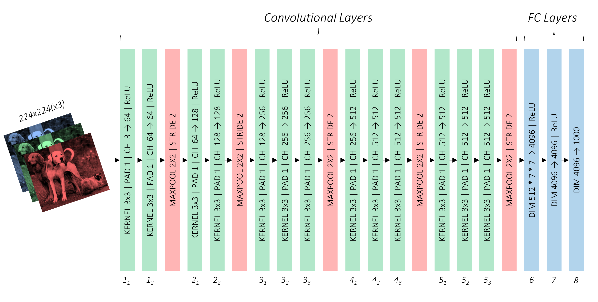

# Object Detection

### Objective:

* **To build a model that can detect and localize specific objects in images.**
* We will be implementing the [Single Shot Multibox Detector (SSD)](https://arxiv.org/abs/1512.02325), a popular, powerful, and especially nimble network for this task.

### Some Concepts

* *Single-Shot Detection*:
  *  Earlier architectures for object detection consisted of two distinct stages – a region proposal network that performs object localization and a classifier for detecting the types of objects in the proposed regions. Computationally, these can be very expensive and therefore ill-suited for real-world, real-time applications. 
  * Single-shot models encapsulate both localization and detection tasks in a single forward sweep of the network, resulting in significantly faster detections while deployable on lighter hardware.
* *Multiscale Feature Maps*:
  * In image classification tasks, we base our predictions on the final convolutional feature map – the smallest but deepest representation of the original image.
  * In object detection, feature maps from intermediate convolutional layers can also be *directly* useful because they represent the original image at different scales. Therefore, a fixed-size filter operating on different feature maps will be able to detect objects of various sizes.
* *Priors*:
  * These are pre-computed boxes defined at specific positions on specific feature maps, with specific aspect ratios and scales. They are carefully chosen to match the characteristics of objects' bounding boxes (i.e. the ground truths) in the dataset.
* *Multibox*:
  * This is [a technique](https://arxiv.org/abs/1312.2249) that formulates predicting an object's bounding box as a *regression* problem, wherein a detected object's coordinates are regressed to its ground truth's coordinates.
  *  In addition, for each predicted box, scores are generated for various object types. Priors serve as feasible starting points for predictions because they are modeled on the ground truths. Therefore, there will be as many predicted boxes as there are priors, most of whom will contain no object.
* *Hard Negative Mining*:
  * This refers to explicitly choosing the most egregious false positives predicted by a model and forcing it to learn from these examples. In other words, we are mining only those negatives that the model found *hardest* to identify correctly. In the context of object detection, where the vast majority of predicted boxes do not contain an object, this also serves to reduce the negative-positive imbalance.
* *Non-Maximum Suppression*:
  *  At any given location, multiple priors can overlap significantly. Therefore, predictions arising out of these priors could actually be duplicates of the same object. Non-Maximum Suppression (NMS) is a means to remove redundant predictions by suppressing all but the one with the maximum score. Ezz

### Brief:

* A box is a box. A **bounding box** is a box that wraps around an object i.e. represents its bounds.

* #### Boundary coordinates:

  * There are 2 ways to represent bounding box.
  * There are (x_min, y_min, x_max, y_max) :: (center_x, center_y, height, width)
  * Both representations are inter-convert-able.

* But pixel values are next to useless if we don't know the actual dimensions of the image. A better way would be to represent all coordinates is in their *fractional* form.Similar to Normalization not exact as normalization

* #### Jaccard Index:

  * The Jaccard Index or Jaccard Overlap or Intersection-over-Union (IoU) measure the **degree or extent to which two boxes overlap**.
  * An IoU of `1` implies they are the *same* box, while a value of `0` indicates they're mutually exclusive spaces.

* ### Multibox:

  * Multibox is a technique for detecting objects where a prediction consists of two components –
    * **Coordinates of a box that may or may not contain an object**. This is a *regression* task.
    * **Scores for various object types for this box**, including a *background* class which implies there is no object in the box. This is a *classification* task.

* ### Single Shot Detector (SSD):

  * The SSD is a purely convolutional neural network (CNN) that we can organize into three parts –

    * **Base convolutions** derived from an existing image classification architecture that will provide lower-level feature maps.
    * **Auxiliary convolutions** added on top of the base network that will provide higher-level feature maps.
    * **Prediction convolutions** that will locate and identify objects in these feature maps.

  * **Base convolutions**:

    * Because models proven to work well with image classification are already pretty good at capturing the basic essence of an image. The same convolutional features are useful for object detection, albeit in a more *local* sense – we're less interested in the image as a whole than specific regions of it where objects are present.
    * Similar to transfer-Learning.
    * 

    * Creaters of SSD recommend using one that's pretrained on the *ImageNet Large Scale Visual Recognition Competition (ILSVRC)* classification task as base convolution.
    * As per the paper, **we've to make some changes to this pretrained network** to adapt it to our own challenge of object detection. Some are logical and necessary, while others are mostly a matter of convenience or preference.
      * Input image is `3,300,300`
      * **Note**: let image be n,m if we pad with 1 and do 3,3 convolution then (n,m)+2(padding)-2(convolution) = n,m.Thus no change in shape of image.
      * Thus in above network size decreases only due to pooling.
      * At 1st Pooling we output `64,150,150`
      * At 2nd Pooling we output `128,75,75`
      * At 3rd Pooling we output `256,38,38`
      * At 4th Pooling we output `512,19,19`
      * We modify the **5th pooling layer** from a `2, 2` kernel and `2` stride to a `3, 3` kernel and `1` stride. The effect this has is it no longer halves the dimensions of the feature map from the preceding convolutional layer.
      * We don't need the fully connected (i.e. classification) layers because they serve no purpose here. We will toss `fc8` away completely, but choose to **rework `fc6` and `fc7` into convolutional layers `conv6` and `conv7`**.
      * 